# Connecting SubWallet to Creditcoin

SubWallet is the comprehensive non-custodial wallet solution for Polkadot, Substrate & Ethereum ecosystems. Built on top of Polkadot {.js}, SubWallet focuses on improving UX & UI. We envision a crypto wallet as a Web3 multiverse gateway through which users can enjoy multi-chain services with utmost ease and absolute security. 
This guide will show you how to manage your accounts, tokens, stake your tokens in-app, and connect to the Creditcoin Staking Dashboard using SubWallet!

## Install SubWallet

SubWallet is available on a range of platforms for you to choose from:

1. A **browser extension** which is available on [Google Chrome](https://chromewebstore.google.com/detail/subwallet-polkadot-wallet/onhogfjeacnfoofkfgppdlbmlmnplgbn), [Brave](https://chromewebstore.google.com/detail/subwallet-polkadot-wallet/onhogfjeacnfoofkfgppdlbmlmnplgbn), [MS Edge](https://chromewebstore.google.com/detail/subwallet-polkadot-wallet/onhogfjeacnfoofkfgppdlbmlmnplgbn) and [Firefox](https://addons.mozilla.org/en-US/firefox/addon/subwallet/).

2. A **mobile app** which is available on the [App Store](https://apps.apple.com/us/app/subwallet-polkadot-wallet/id1633050285) and [Google Play Store](https://play.google.com/store/apps/details?id=app.subwallet.mobile).

3. A web dashboard that does not require any downloading and can be accessed through https://web.subwallet.app

For this tutorial, we will walk you through the process of creating a wallet using the browser extension.

## Setup an account

Once you have installed the extension, you'll have the option to **create**, **import** or **attach an account** ([Ledger](https://docs.subwallet.app/main/extension-user-guide/account-management/connect-ledger-device), [Keystone](https://docs.subwallet.app/main/extension-user-guide/account-management/connect-keystone-device), [Polkadot Vault](https://docs.subwallet.app/main/extension-user-guide/account-management/attach-a-polkadot-vault-previously-parity-signer-account) and [Watch-only account](https://docs.subwallet.app/main/extension-user-guide/account-management/attach-a-watch-only-account))

> :memo: **Note**
    Creditcoin is a Substrate-native chain, so you will only be able to view and interact with Creditcoin by creating or importing a Substrate account.

### Create a new account

To create a new account, click on **Create a new account**.

You will then need to create your master password which keeps all of your accounts secure. Once you have entered the password and then confirmed it, click on **Continue**.

> :memo: **Note**
    For each seed phrase created with SubWallet, you would have a Substrate account and an Ethereum account. 
    Substrate account would display your assets on Substrate-native blockchains (such as Polkadot, Kusama), while Ethereum account would display your assets on Ethereum chains (such as Moonbeam). 

Now you will be shown a seed phrase together with the option to back it up. Once you have saved and stored it in a safe place, choose **I have kept it somewhere safe**.

> :warning: **Caution**
    You should never share your seed phrase (mnemonic) or private key with anyone. This gives them direct access to your funds.

You have finished creating a new account! If you want to create additional accounts, follow these steps:
1. Choose the accounts tab on the top of the extension.

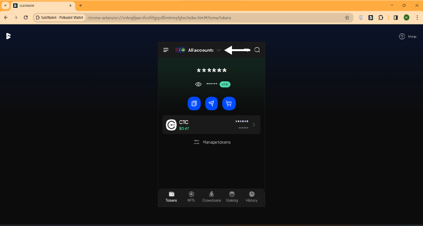

2. Click on **Create a new account** and repeat the steps above.

### Import an existing account

To import an account that you have already created, choose **Import an account**. 

> :memo: **Note**
    Creditcoin is a Substrate-native chain, so you will only be able to view and interact with Creditcoin by creating or importing a Substrate account.

Then you can choose your preferred method of importing.

After you have chosen a method, you will be prompted to create a master password. Enter your password and click on **Continue**.

> :warning: **Caution**
    Please note that SubWallet is non-custodial, so you would be the only person who knows your password; we cannot help you restore your password once it is lost. Please make sure that your password is well-kept.

#### Using seed phrase

You could choose between importing either a Substrate account or Ethereum account, or both. After choosing, click on **Import account**

Enter your seed phrase in the text boxes. You can use either a 12-word seed phrase or a 24-word seed phrase to import your account. Click on **Import account** and your account has been imported!

> :exclamation:  **Incompatibility**
    In some cases, if you import an account from a seed phrase, problems can arise if the seed phrase of your original wallet is not compatible with SubWallet. **Trust Wallet** and **Safepal** are among the wallets not compatible with us. 

#### Using Polkadot.js JSON file

You can import a Polkadot.js account after exporting the JSON backup file. Click on the **Import from Polkadot.js** field to upload a file from your device, or drag and drop your JSON file into the field.

You will then need to enter your JSON file password (created when you set up the wallet for the first time) and click **Import by JSON file**. 

> :memo: **Note**
    If you want to import multiple accounts simultaneously from a JSON file, you are required to enter the password for each account you want to import.

#### Using MetaMask private key

Once you have exported your private key, enter it into the text box then click on **Import account**.

#### Using QR code

Click on **Scan QR**. If you have not enabled camera access yet, a message will show up prompting you to **Go to settings**.

 On the settings page, toggle on **Camera access for QR** then head back to the QR page, click on **Scan QR** and scan your accounts' QR code. After the successful import of your account by QR code, you will be directed to the Homepage. 

#### Import additional accounts

You have finished importing your account! If you want to import additional accounts, follow these steps:
1. Choose the accounts tab on the top of the extension.

2. Click on the **Import** icon and repeat the steps above.

## Interacting with Creditcoin

### Managing CTC on SubWallet

To manage CTC on SubWallet, choose the **Customize asset display** icon next to the search icon.

On the search bar, search for **Creditcoin**. Toggle on the network to enable it.

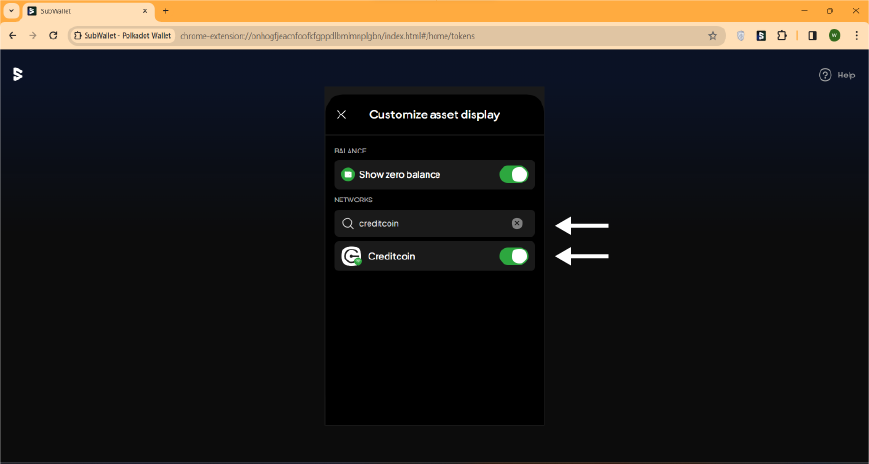

Head back to the home screen. You should be able to see that Creditcoin has been connected and CTC should be displayed.

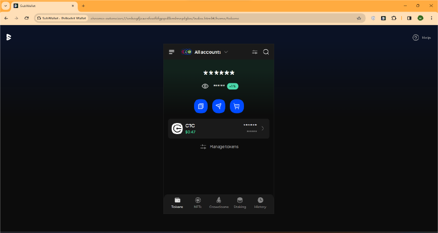

> :memo: **Note**
    Creditcoin is a Substrate-native chain, so you will only be able to view and interact with Creditcoin using a Substrate account.

## Receive token

From your home screen, choose the first blue icon under the eye. 

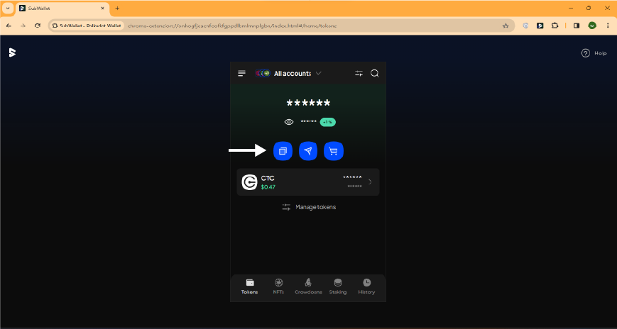

> :exclamation:  **If you are in all-accounts mode**
    You will be prompted to choose an account if you are in all-accounts mode.
    

Search for the token that you would like to receive, in this case, CTC. You can either **Copy the address** or **View address QR**.

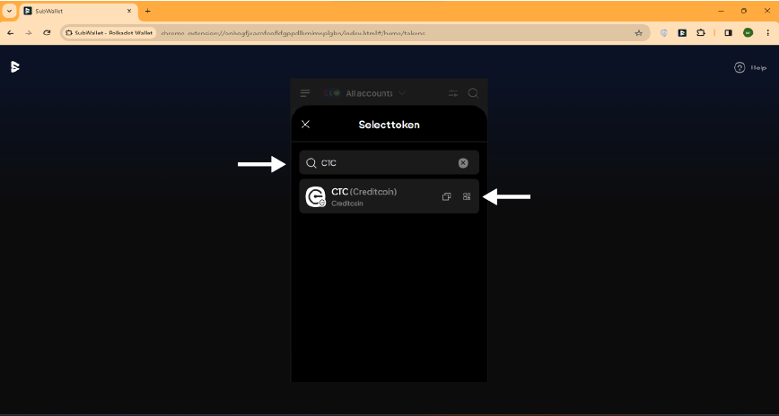

Send the address or show the QR code to the sender and you'll be able to receive CTC from them!

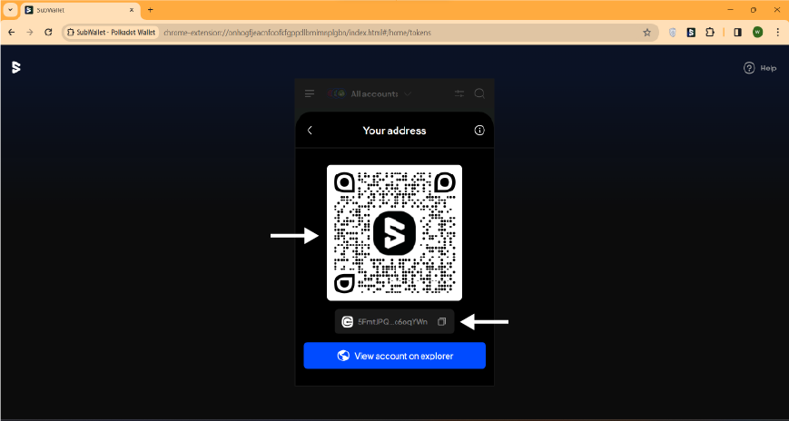

### Send a transaction

To get started with a simple token transfer to another address on Creditcoin, you can click the send icon.

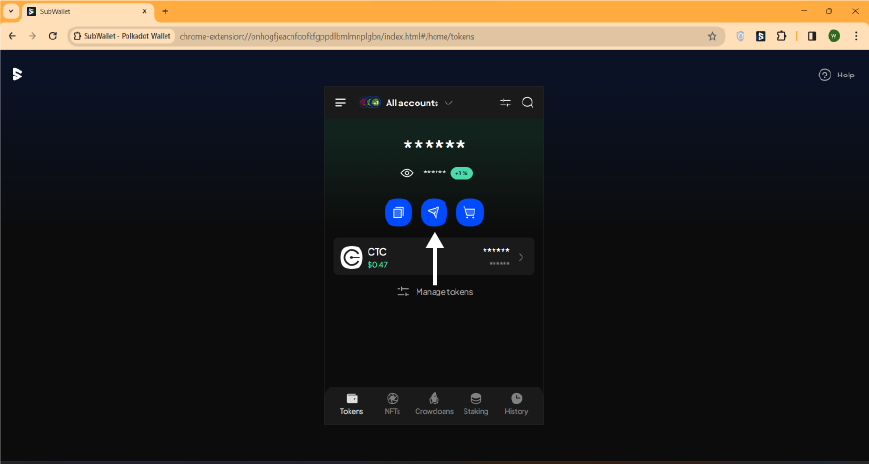

Next, you can take the following steps:

1. Specify the asset to send and the destination chain. 
2. Enter the destination address
3. Enter the amount of tokens to send
4. Look over the transaction details, then press **Transfer**

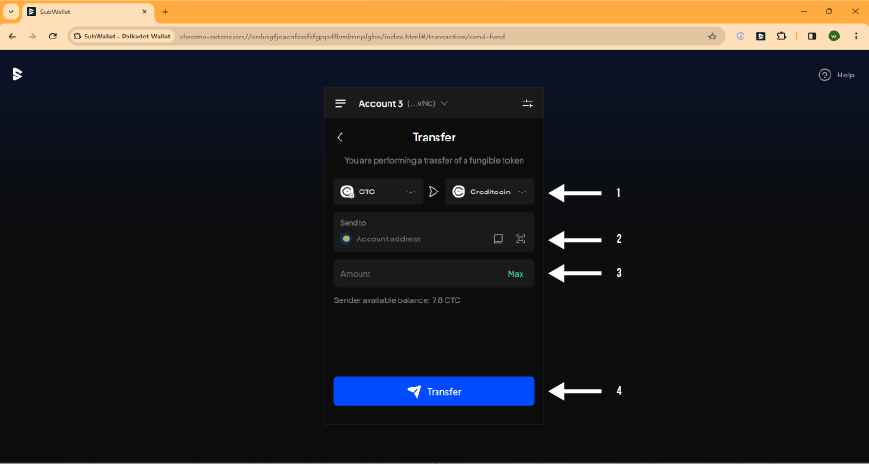

On the next screen, you can review the transaction details and submit the transaction. If the transaction details look good, you can click **Approve** to send the transaction.

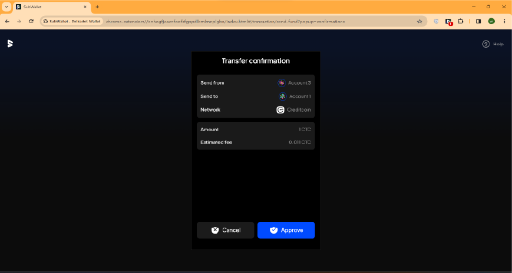

After you send the transaction, you can review the transaction details.

### Connect to the Creditcoin Staking Dashboard

First, head to the [Creditcoin Staking Dashboard](https://staking.creditcoin.org/). Once you arrive at the dashboard, you will need to connect your wallet. 

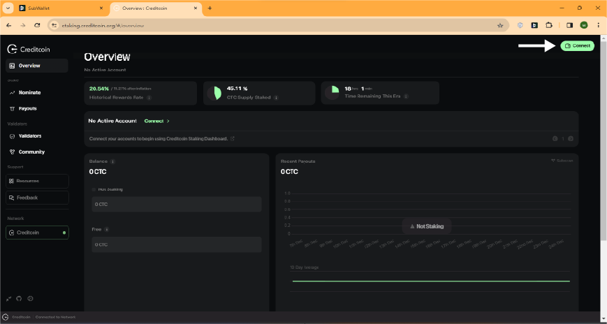

Click on **Connect** in the SubWallet section.

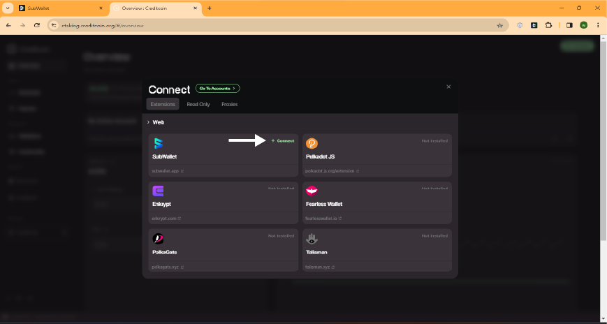

A window will appear. Choose the account that you would like to connect then choose **Connect**.

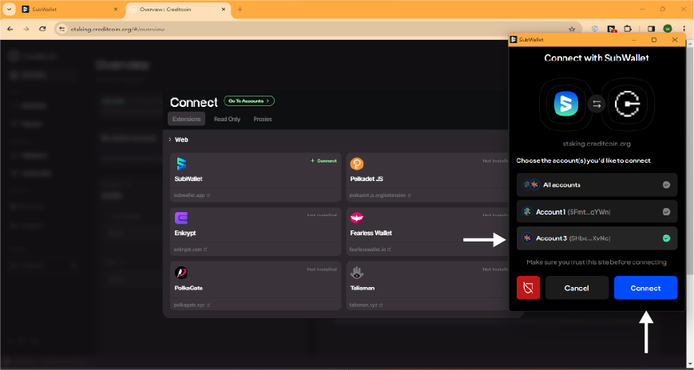

Once you have approved the connection, you will need to choose the account that you would like to use on the Staking Dashboard by clicking **Go to accounts**.

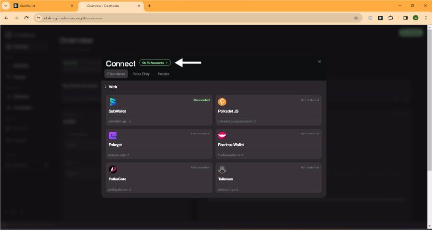

You can have multiple accounts connected to the Staking Dashboard. Choose your  desired account.

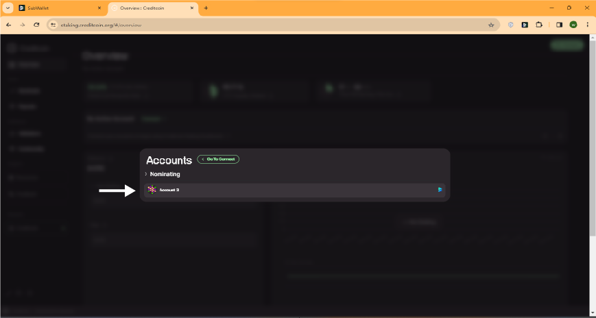

You have successfully connected to the Creditcoin Staking Dashboard!

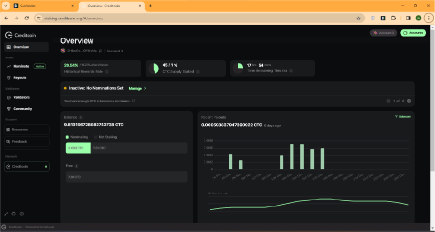

### In-app Staking

Head to the **staking** tab on the navigation bar.

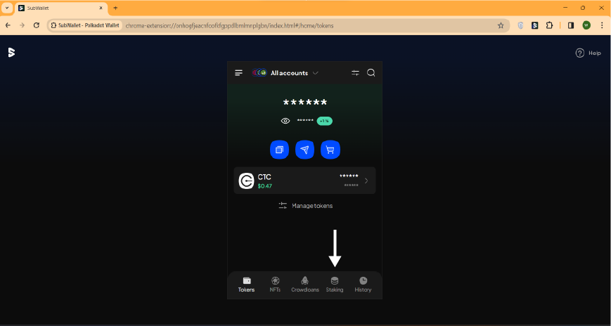

On the staking screen, choose the **+** icon on the top right of the screen.

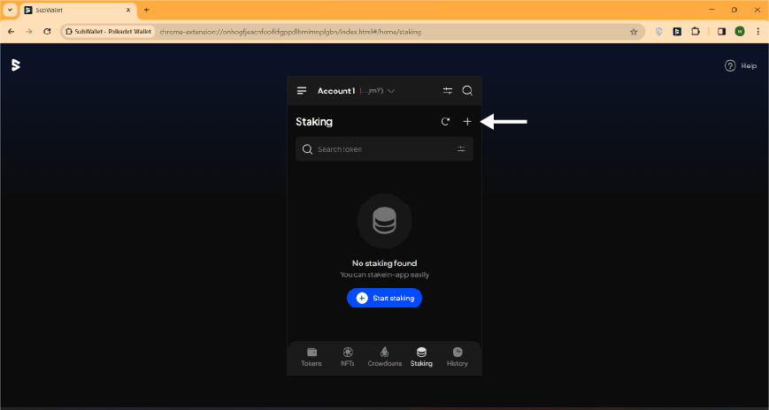

Choose the **Nominate** tab in the "Add to Bond" screen and enter the staking information:

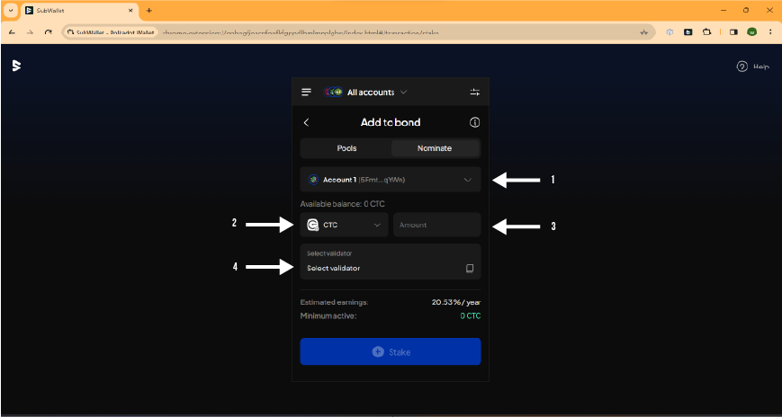

1. Choose the account from which you would like to stake (if you are in all accounts mode)
2. Choose the token that you would like to stake, in this case, CTC.
3. Enter the amount of tokens.
4. Select a validator.

A list of available validators will be shown. It is suggested that you pay close attention to the validator you are choosing. When selecting a validator, SubWallet supports you with the latest record of validator details. Click the three-dot icon on the right-hand side of each validator to see the their details.

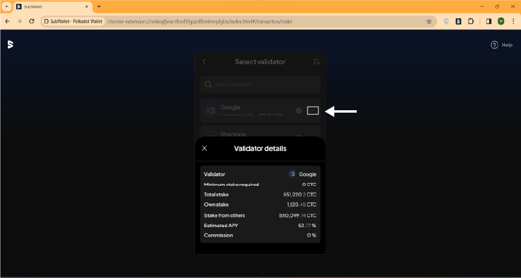

In addition, you could use the sort function to find the most suitable validator according to your needs. Click the sort icon on the upper right corner and choose your sorting criteria. 

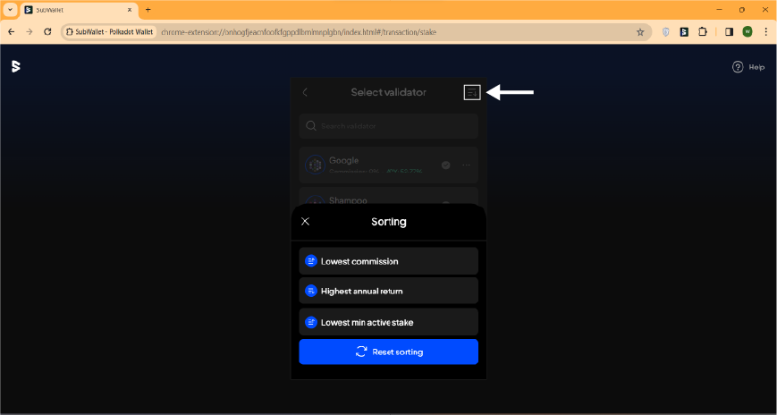

After all the staking information is entered, click on **Stake** then approve the transaction. 
